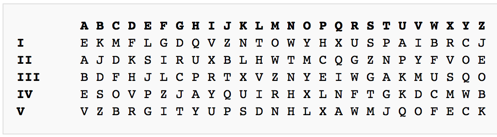

# `PHOQSE` by [@michalbe](http://github.com/michalbe)

## Rotors' wirings

## Links
 - [How it works?](https://www.youtube.com/watch?v=uMPw0ObNJbQ)
 - [Enigma Code by NSA](https://www.youtube.com/watch?v=ncL2Fl6prH8)
 - [How Enigma Machines work?](http://enigma.louisedade.co.uk/howitworks.html)
 - [Plans](http://www.fcet.staffs.ac.uk/jdw1/sucfm/bletchleypark.htm)
 - [The Enigma Machine](http://www.math.ucsd.edu/~crypto/students/enigma.html)
 - [HOWTO make a papercraft Enigma machine?](http://boingboing.net/2012/06/01/howto-make-a-papercraft-enigma.html)
 - [pl] [Zasada działania](http://edu.i-lo.tarnow.pl/inf/hist/006_col/0001.php)
 - [pl] [Składniki maszyny](http://edu.i-lo.tarnow.pl/inf/hist/006_col/0002.php)

## Dev notes

 - files to copy: `csg.js`, `openscad.js`, `openjscad.js`, `imgs/busy.gif`
 - to run a watcher: `grunt --model="part_name/model_name.jscad"`
 - set proper syntax highlighter in Atom: `shift`+`ctrl`+`l`
