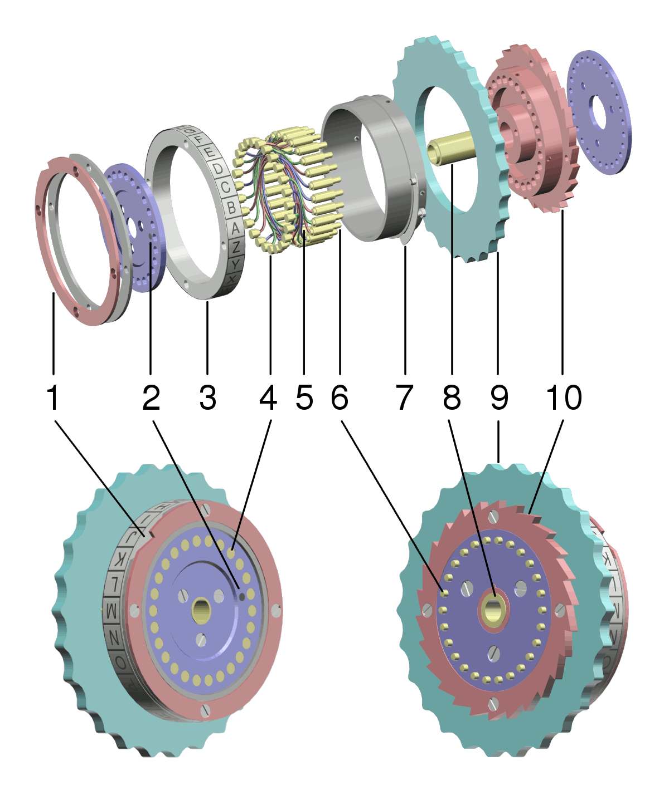

## Rotors

Exploded view of an Enigma machine rotor. Labeled components are as follows:
 1. Notched ring, used to "carry" the rotation of one rotor to another via a ratchet mechanism
 2. Dot marking the position of the "A" contact, for use by the operator in assembling the rotor
 3. Alphabet "tyre" or ring; some rings had a sequence of numerals instead of letters
 4. Electrical plate contacts
 5. Wire connections joining the plate contacts to the pin contacts
 6. Spring-loaded pin contacts
 7. Spring-loaded ring adjusting lever, used to alter the position of the alphabet ring; a pin on the lever fits into holes in the side of the alphabet ring
 8. Hub, through which fits the central axle
 9. Finger wheel, used to manually set the orientation of the rotor
 10. Ratchet mechanism
